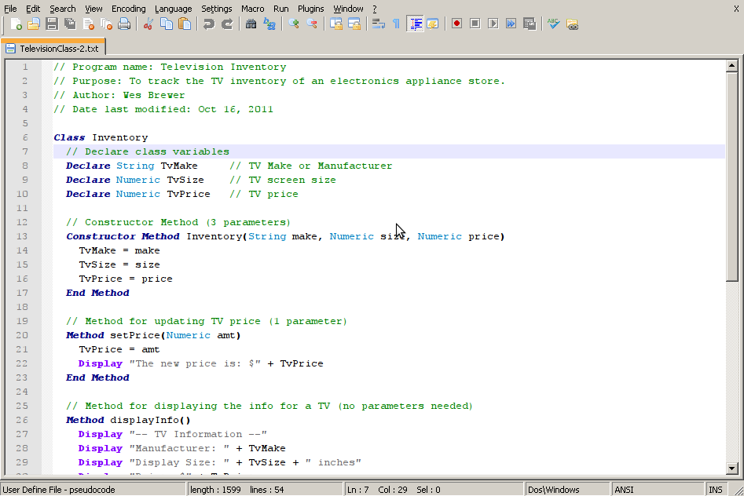

# PseudoCode Syntax for Notepad++

PseudoCode Syntax for use in Notepad++ with the book titled [Principles of Program Design: Problem-Solving with JavaScript](https://www.amazon.ca/Principles-Program-Design-Problem-Solving-JavaScript/dp/1111526508) by Paul Addison.

While I attended an intro to programming course in college, the above mentioned textbook was used. Throughout the book the author used a form of pseudocode to help with the understanding of basic programming concepts.

Many of the students in our course used [Notepad++](https://notepad-plus-plus.org/) as their editor of choice. As such, I created a user defined language file for Notepad++ which applies syntax highlighting for this pseudocode.

It is simple, works fairly well and is a lot better than looking at black and white text.
It is in no way feature complete and probably won't work if you're already using custom User Defined Language files.

The colour scheme matches the feel of notepad++ default javascript highlighting, complementing the use of javascript found later in the book.

## Screenshot

## Installation

1. download userDefineLang.xml
2. open Notepad++
3. click on menu –> Language –> Define your language…
4. click on Import… and choose the file (userDefineLang.xml)
5. close and re-open Notepad++
6. click on menu –> Language –> pseudocode
7. profit
